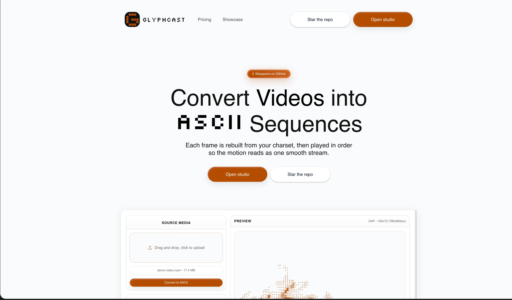
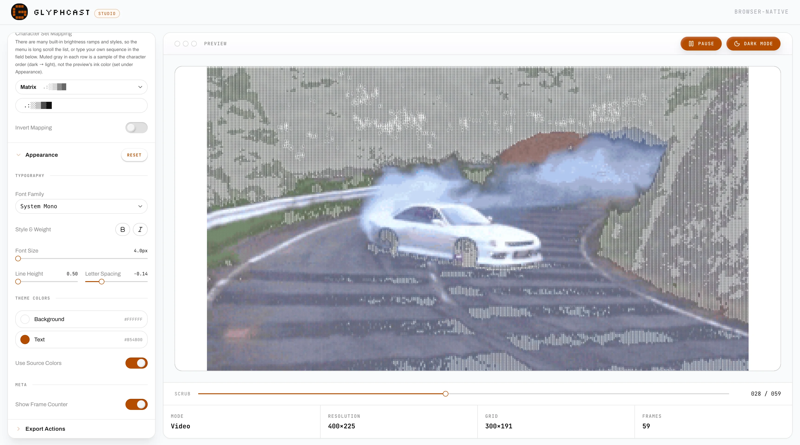
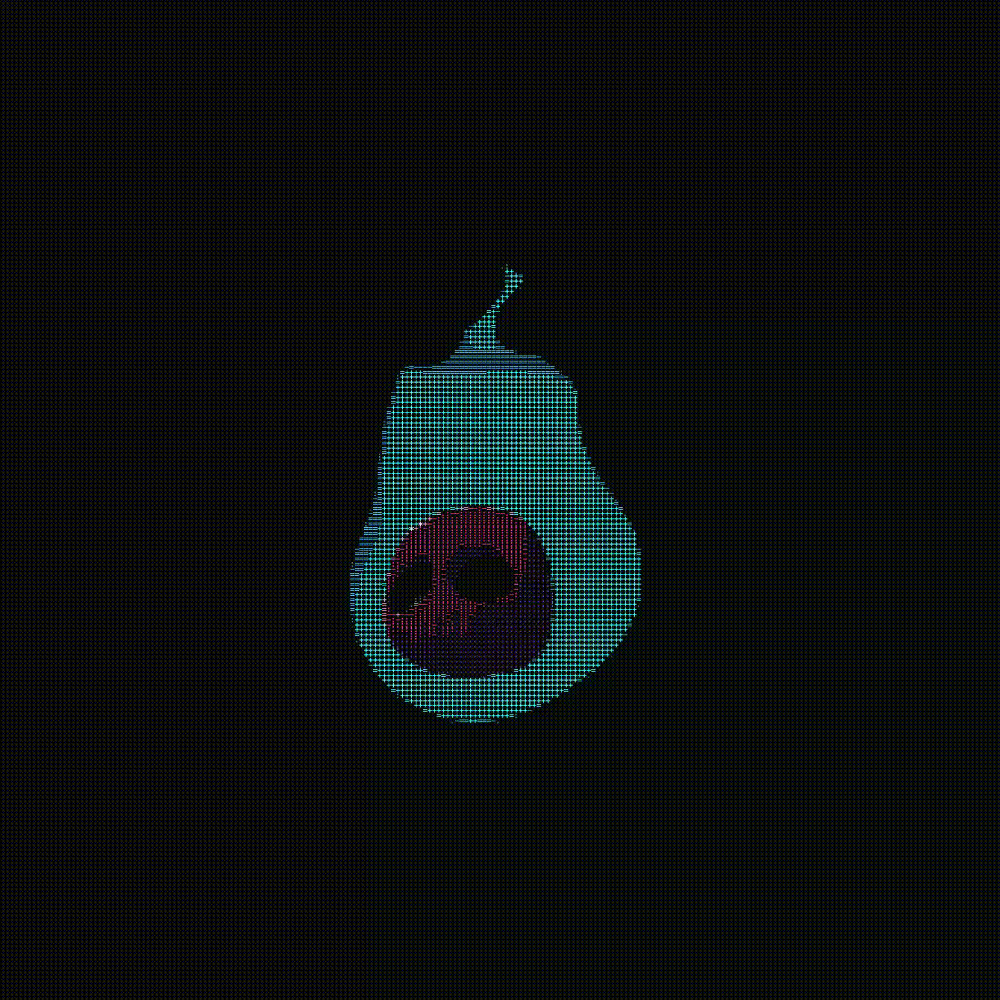
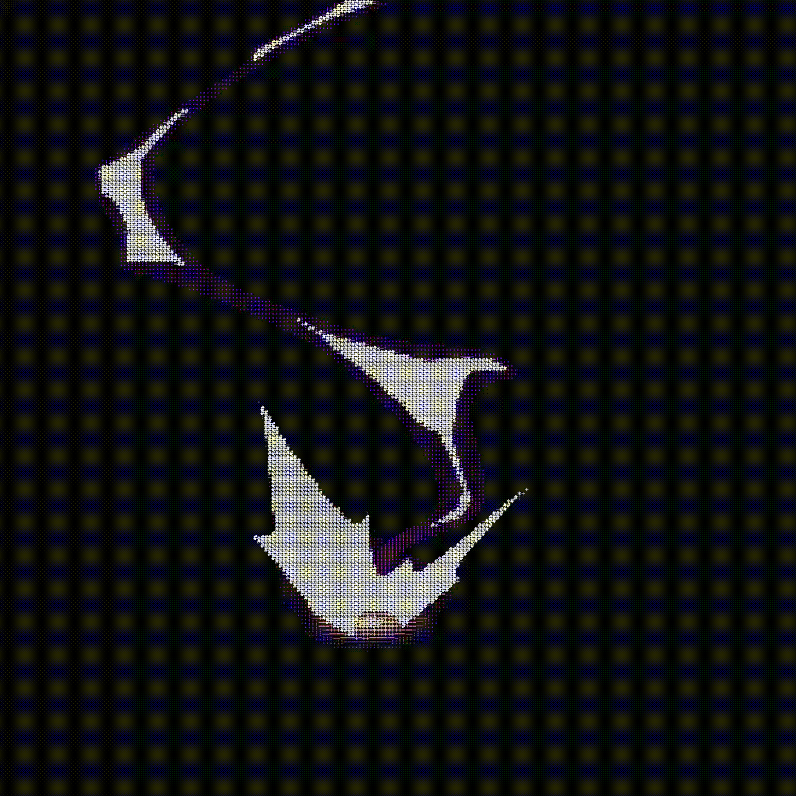

<p align="center">
  
</p>

<h1 align="center">Monowave</h1>

<p align="center">Convert videos into ASCII sequences.</p>
<p align="center">Browser-native ASCII studio for image, GIF, and video workflows.</p>

## About The Project

Monowave is an interactive studio that converts visual media into animated ASCII output.  
Each frame is sampled on a pixel grid, mapped to a character set by luminance, styled with typography/effects, and rendered in real time for preview and export.

The studio supports:

- source uploads (image, GIF, video)
- live preview and playback controls
- editable charset, columns, threshold, invert, and appearance controls
- multiple export formats for design, code, and content pipelines

## Project Preview




<table>
  <tr>
    <td></td>
    <td></td>
  </tr>
  <tr>
    <td></td>
    <td></td>
  </tr>
</table>

Add your video file to `assets/site` and update this link path when ready.

## Core Features

- Real-time ASCII conversion with adjustable columns and threshold
- Rich charset presets (`Standard`, `Retro Terminal`, `Matrix`, `Binary`, and more)
- Appearance controls for font family, size, spacing, colors, and text effects
- Playback/scrubbing for animated sources (video and GIF)
- Built-in exports:
  - PNG snapshot
  - video export (browser MediaRecorder, MP4/WebM support depending on browser)
  - React component (`.tsx`) export for embedding generated animations
  - ZIP export of per-frame text files
  - one-click copy of current ASCII frame to clipboard

## How Conversion Works

Monowave’s conversion pipeline is implemented in `src/lib/ascii-converter.ts` and `src/lib/ascii-export.ts`.

1. Resolve source dimensions (`image`, `video`, or `canvas`)
2. Downsample source to ASCII grid (`columns` x derived `rows`) on an offscreen canvas
3. Compute luminance using ITU-R BT.601 coefficients (`0.299r + 0.587g + 0.114b`)
4. Map luminance to charset index (with optional invert + threshold offset)
5. Build text frame and optional per-cell RGB colors
6. Render preview/export frames with appearance settings and optional effects

## Studio UX Details

- **Input types:** `image/*`, `video/*`, and `image/gif`
- **Upload limit:** 30 MB max source file (intentional guardrail to prevent very large video/asset uploads in the browser studio)
- **Default video behavior:** auto-loads a demo clip in studio when no source is present
- **Keyboard shortcuts:**
  - `Space` → play/pause
  - `Left / Right` → frame step
  - `Cmd/Ctrl + S` → trigger export action

## Tech Stack

- Next.js 16 (App Router)
- React 19
- TypeScript
- Tailwind CSS 4
- Framer Motion
- Zustand
- Radix UI primitives
- `gifuct-js` for GIF frame decoding
- `fflate` for ZIP frame exports

## Project Structure

```text
Monowave/
├── assets/
│   └── site/                  # README/site branding assets
├── public/                    # static media, logos, preview clips
├── src/
│   ├── app/
│   │   ├── page.tsx           # landing page
│   │   └── studio/page.tsx    # ASCII studio page
│   ├── components/            # UI + studio + landing components
│   └── lib/
│       ├── ascii-config.ts    # presets/defaults/types
│       ├── ascii-converter.ts # source -> ASCII conversion
│       ├── ascii-export.ts    # PNG/video/ZIP/React exports
│       └── store.ts           # global studio state (Zustand)
├── example.env
└── README.md
```

## Configuration

Copy env values from `example.env`:

```bash
cp example.env .env
```

Environment variables:

- `NEXT_PUBLIC_SITE_URL` — base URL used by metadata routes
- `NEXT_PUBLIC_GITHUB_REPO` — repo slug in `owner/name` format

## Getting Started

### Prerequisites

- Node.js 20+
- Bun

### Install and run

```bash
bun install
bun run dev
```

Open `http://localhost:3000`.

### Available scripts

```bash
bun run dev
bun run build
bun run start
bun run lint
bun run format
```

## Output Formats

- **Image export:** PNG of current rendered frame
- **Video export:** canvas-recorded animation (MP4/WebM depending on browser support)
- **React export:** generated TSX component with frame data + playback logic
- **ZIP export:** sequence of text frames (`frame_0001.txt`, etc.)
- **Clipboard export:** current frame plain text

## Known Notes

- Video encoding capability depends on the browser’s `MediaRecorder` codec support.
- Large files and high frame counts increase export time and memory usage.
- The 30 MB upload cap is intentional so users cannot upload oversized videos/assets that degrade in-browser conversion performance.
- Browser permissions can block clipboard access.

## Links

- GitHub: [vishu7im/Monowave](https://github.com/vishu7im/Monowave)
- X: [@vishu7im](https://x.com/vishu7im)
- LinkedIn: [vishal munday](https://www.linkedin.com/in/vishal-munday-869024223/)
